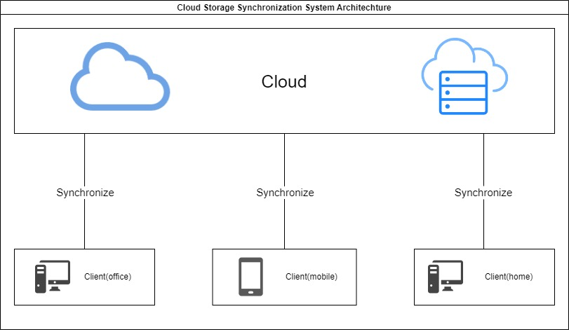

# CloudSyncGO

CloudSyncGO is a synchronization tool that helps to sync files between local storage and cloud object storage.

This project achieves two-way, real-time synchronization.
It can synchronize files from local to cloud, or from cloud to local.
Therefore, it is able to sync user data for different sources by leveraging the cloud storage as a mediator.



CloudSync Tencent COS.
In theory, it supports any object storage that implements the standard read-write APIs.

GO 1.21.4 is used for development.

## Installation

1. Install requirements

    CloudSync installation requires [GO 1.21.4](https://golang.google.cn/).

    Please install them before using this code.


2.Install dependencies

    
    go get -u github.com/tencentyun/cos-go-sdk-v5

## Usage

You should enter the directory of the project and run

```bash
go run main/main.go
```


